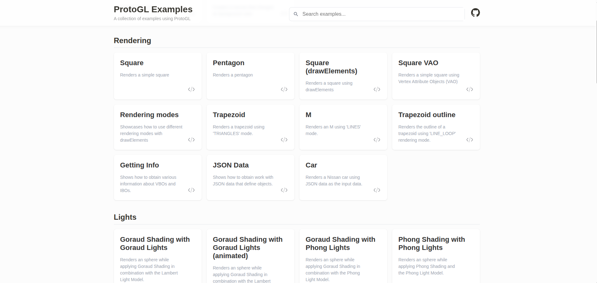

# proto-gl

Computer Graphics Library on the Web.

[Examples](https://proto-gl.vercel.app/)

---

## How to run

First of all you will need to install the dependencies by running:

```bash
pnpm install
```

### Development

The optimal way of developing is testing out the library using the examples. This library has been configured with hot-reload, so whenever a change is made to its source code it could be immediately available on the example implementation by just executing:

```bash
pnpm dev
```

This spins up a server on `http://localhost:5173`.



### Production

You build the project as follows:

```bash
pnpm build
```

This will transpile the `typescript` code as well as minify it.

### Testing

In order to run the unit tests, execute the following:

```bash
pnpm test
```

### Examples

If you want to run in development mode independently from the library you can by executing:

```bash
pnpm run dev
```

And now you can check out the examples on `http://localhost:5173`.

In case you want to build the examples, you can by executing:

```bash
pnpm build
```

This will create a `dist` folder that you can serve however you like, or by using `pnpm run preview` ;).
